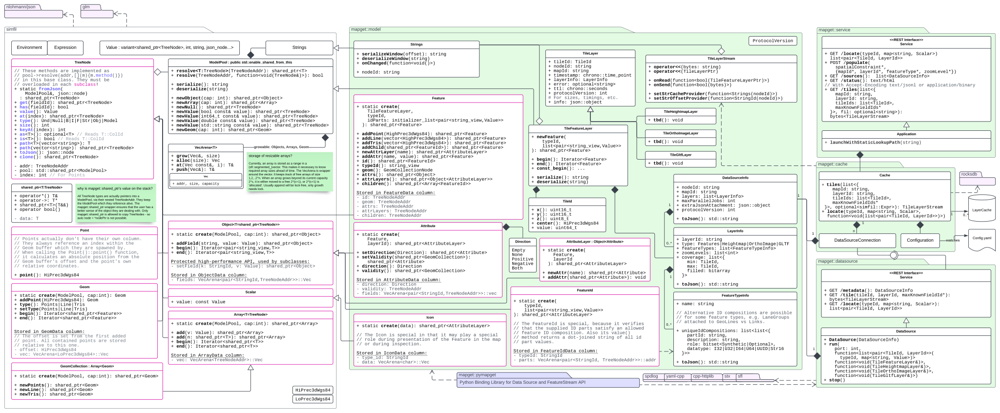

# mapget

*mapget* is a server-client solution for cached map feature data retrieval.

## Features

The atomic units of geographic data which are served by *mapget* are *Features*.
The content of a *mapget* feature is aligned with that of a feature in *GeoJSON*:
A feature consists of a unique ID, some attributes, and some geometry. *mapget*
also allows features to have a list of child feature IDs. Note: Feature geometry
in *mapget* may always be 3D.

## Tiles

For performance reasons, *mapget* features are always served in a set covering
a whole tile. Each tile is identified by a zoom level `z` and two grid
coordinates `x` and `y`. *mapget* uses a binary tiling scheme for
the earths surface: The zoom level `z` controls the number of subdivisions for
the WGS84 longitudinal `[-180,180]` axis (columns) and latitudinal `[-90,90]` axis (rows).
The tile `x` coordinate indicates the column, and the `y` coordinate indicates the row.
On level zero, there are two columns and one row. In general, the number of rows is `2^z`,
and the number of columns is `2^(z+1)`.

The content of a tile is tied to the geographic extent of its tile id, but also to
the map layer it belongs to. When a data source creates a tile, it associates the
created tile with the name of the map - e.g. *"Europe-HD"*, and a map data layer,
e.g. *"Roads"* or *Lanes*.

## Data Sources

### Introduction

At the heart of *mapget* are data sources, which provide map feature data for
a specified tile area on the globe and a specified map layer. The data source
must provide information as to

1. Which maps it can serve (e.g. China/Michigan/Bavaria...).
2. Which layers it can serve (e.g. Lanes/POIs/...).
3. Which feature types are contained in a layer (e.g. Lane Boundaries/Lane Centerlines),
   and how they are uniquely identified.

Implementing a data source could be as simple as the following example (C++):

```cpp
#include "mapget/datasource.h"
#include "nlohmann/json.h"

char const* myFeatureType = "FancyLineFeature";
char const* myFeatureId = "FancyLineFeatureId";

int nextFeatureId = 0;

/**
 * Function which describes the data source.
 */
mapget::DataSourceInfo getDataSourceInfo()
{
    return mapget::SimpleDataSourceInfo("MyMap", "MyMapLayer", myFeatureType);
}

/**
 * Function which adds a feature to a TileLayer.
 */
void addFeatures(TileLayer& tileLayer)
{
    // Create a new feature.
    auto feature = tileLayer->newFeature(myFeatureType, nextFeatureId++);

    // Add a point to it to give it geometry.
    feature->geom()->addPoint(tileLayer->tileId->center());

    // Set a simple key-value attribute.
    feature->attrs()->setField("name", "Darth Vader");

    // We can create nested attributes.
    feature->attrs()->setField("greeting", tileLayer->newObject()
        ->setField("en", "Hello World!"),
        ->setField("es", "Hola Mundo!"));

    // We can also use nlohmann::json for attributes
    feature->attrs()->setField("greeting", json::object({
        {"en", "Hello World!"},
        {"es", "Hola Mundo!"},
    }));
}

void main(int argc, char const *argv[])
{
    auto myDataSource = DataSource(getDataSourceInfo());

    myDataSource.run([&](auto& tileLayer)
    {
        // Lambda function which fills a feature-set for the
        // given tileId and layerId.

        addFeatures(tileLayer);
    });

    return 0;
}
```

**Note:** The referenced `SimpleDataSourceInfo` function is short for:

```cpp
return mapget::DataSourceInfo("MyMap", {
    mapget::LayerInfo(
        "MyMapLayer", // Name of our layer
        {
            mapget::FeatureTypeInfo(myFeatureType,
            {                             
                mapget::IdComponent(
                    myFeatureId,
                    mapget::IdType::U32
                )
            })
        }
    )
})
```

## Retrieval Interface

The `mapget` library provides simple C++ and HTT/REST interfaces, which may be
used to satisfy the following use-cases:

* Obtain streamed map feature tile data for given constraints.
* Locate a feature by its ID within any of the connected sources.
* Describe the available map data sources.
* View a simple HTML server status page (only for REST API).
* Instruct the cache to populate itself within given constraints from the connected sources.

The HTTP interface implemented in `mapget::service` is a view on the C++ interface,
which is implemented in `mapget::cache`. Detailed endpoint descriptions:

```c++
// Obtain a list of tile-layer combinations which provide a
// feature that satisfies the given ID field constraints.
+ GET /locate(typeId, map<string, Scalar>)
  list<pair<TileId, LayerId>>

// Describe the connected Data Sources
+ GET /sources():  list<DataSourceInfo>

// Get streamed features, according to hard constraints.
// With Accept-Encoding text/jsonl or application/binary
+ GET /tiles(list<{
    mapId: string,
    layerId: string,
    tileIds: list<TileId>,
        maxKnownFieldIds*
  }>, fil: optional<string>):
  bytes<TileLayerStream>

// Server status page
+ GET /status(): text/html

// Instruct the cache to populate itself
+ POST /populate(
    spatialConstraint*,
    {mapId*, layerId*, featureType*, zoomLevel*}) 
```

For example, the following curl call could be used to stream GeoJSON feature objects
from the `MyMap` data source defined previously:

```bash
curl -X GET "http://localhost/tiles?mapId=MyMap&layerId=MyMapLayer&tileIds=393AC,36D97" \
     -H "Accept-Encoding: text/jsonl"
```

If we use `"Accept-Encoding: application/binary"` instead, we get a binary stream of
tile data which we can parse in C++, Python or JS. Here is an example in C++, using
the `TileLayerStream` class:

```C++
#include "mapget/tilestream.h"
#include "httplib.h"  // Using cpp-httplib
#include <iostream>

void main(int argc, char const *argv[])
{
    mapget::TileLayerStream streamParser;
    streamParser.onRead([](mapget::TileFeatureLayerPtr tileFeatureLayer){
        std::cout << "Got tile feature layer for " << tileFeatureLayer->tileId.value();
    });

    httplib::Client cli("localhost", 1234);
    auto res = cli.Get(
        "/tiles?mapId=MyMap&layerId=MyMapLayer&tileIds=393AC,36D97",
        [&](const char *data, size_t length) {
            streamParser << std::string(data, length);
            return true;
        }
    );

    return 0;
}
```

We can also use `mapget::Cache` instead of REST:

```C++
#include "mapget/tilestream.h"
#include "httplib.h"  // Using cpp-httplib
#include <iostream>

void main(int argc, char const *argv[])
{
    // Reads MAPGET_CACHE_DB and MAPGET_CONFIG_FILE environment vars.
    // You can override them in the constructor.
    mapget::Cache cache;

    cache.tiles({{"MyMap", "MyMapLayer", {0x393AC,0x36D97}}}).onRead([](mapget::TileFeatureLayerPtr tileFeatureLayer){
        std::cout << "Got tile feature layer for " << tileFeatureLayer->tileId.value();
    });

    return 0;
}
```

## Configuration

The `mapget::Cache` class parses a config file, from which it knows about available data source
endpoints. The path to this config file may be provided either via the `MAPGET_CONFIG_FILE` env.
var, or via a constructor parameter. The file will be watched for changes, so you can update
it, and the server will immediately know about newly added or removed sources. The structure of
the file is as follows:

```yaml
sources:
  - <url>  # e.g. http://localhost:12345
```

## Architecture


